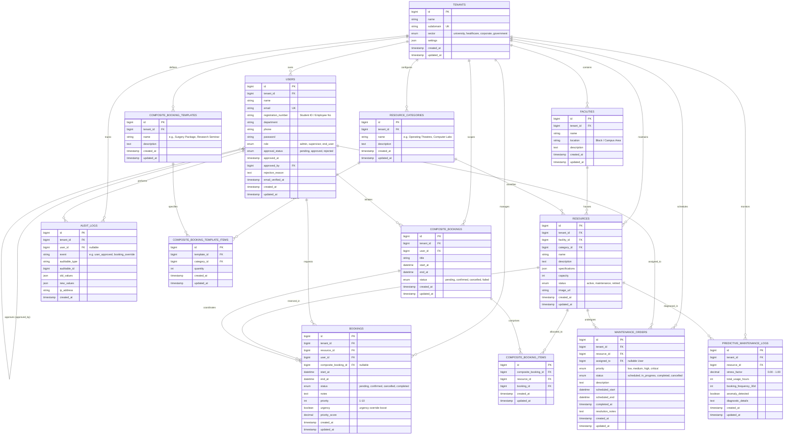
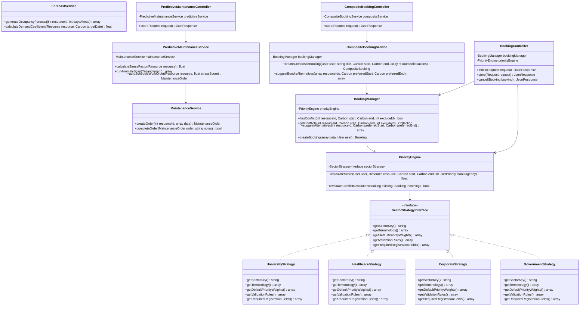
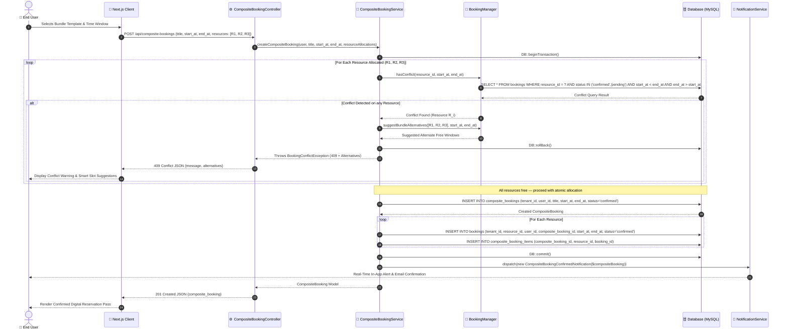
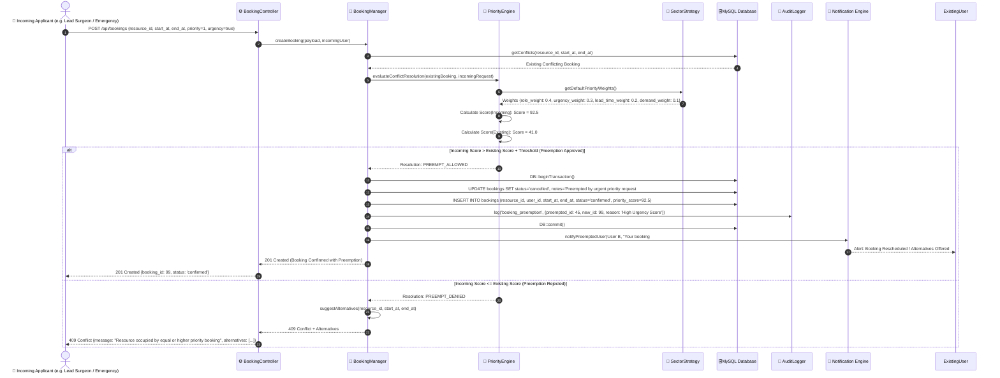
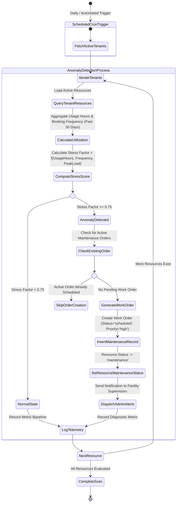

# FaciliCore Architecture & Technical Report: Figures 5.2 – 5.8

---

## 1. Figure 5.2: Complete Database Entity-Relationship Diagram (ERD) with Multi-Tenancy Keys

This diagram illustrates the complete relational schema design for FaciliCore's single-database multi-tenant architecture. Every tenant-specific table contains foreign key `tenant_id` linked to `tenants.id` and is automatically scoped by Eloquent's `TenantScope`.

---

## 2. Figure 5.3: Comprehensive System Use Case Diagram across User Roles

This diagram captures user interactions with FaciliCore across all four primary actors: **Central Superadmin**, **Workspace Administrator**, **Operational Supervisor**, and **Regular Tenant User (End User)**.

```mermaid
graph TD
    %% Actors
    CentralAdmin(["👤 Central Superadmin"]):::actor
    WorkspaceAdmin(["👤 Workspace Admin"]):::actor
    Supervisor(["👤 Supervisor / Dept Head"]):::actor
    EndUser(["👤 Regular Tenant User"]):::actor

    %% Central Admin Use Cases
    subgraph Central_Management ["Central Platform Governance"]
        UC_CentralRegister["Register New Tenant Workspace"]:::usecase
        UC_TenantMonitor["Monitor Multi-Tenant Health"]:::usecase
        UC_SectorAssign["Assign Sector Strategy Configuration"]:::usecase
    end

    %% Workspace Admin Use Cases
    subgraph Admin_Console ["Workspace Administration"]
        UC_ApproveUsers["Review & Approve Tenant User Registrations"]:::usecase
        UC_ManageRoles["Promote User Roles & Permissions"]:::usecase
        UC_FacilityManage["Manage Campus Facilities & Building Blocks"]:::usecase
        UC_ResourceManage["Configure Physical Resources & Categories"]:::usecase
        UC_PriorityWeights["Tune Sector Priority Engine Weights"]:::usecase
        UC_PredictiveScans["Trigger ML Predictive Anomaly Scans"]:::usecase
        UC_AuditReview["Inspect Tenant Security Audit Logs"]:::usecase
    end

    %% Supervisor Use Cases
    subgraph Supervisor_Console ["Operational Supervision"]
        UC_ApproveBookings["Evaluate Pending Approval Bookings"]:::usecase
        UC_MaintenanceSchedule["Schedule Resource Work Orders"]:::usecase
        UC_AnalyticsView["Analyze Occupancy & Utilization Telemetry"]:::usecase
        UC_Forecasting["View ML Occupancy Forecast Models"]:::usecase
    end

    %% End User Use Cases
    subgraph Mobile_Companion ["End User Booking Portal"]
        UC_Register["Submit Tenant Registration (with ID & Dept)"]:::usecase
        UC_Browse["Browse Campus Directory & Resources"]:::usecase
        UC_SingleBook["Create Single Resource Reservation"]:::usecase
        UC_CompositeBook["Execute Multi-Resource Composite Bundle"]:::usecase
        UC_ViewPasses["Access Digital Passes & QR Check-in"]:::usecase
        UC_Notifications["Receive Real-Time Status Notifications"]:::usecase
    end

    %% Relationships
    CentralAdmin --> UC_CentralRegister
    CentralAdmin --> UC_TenantMonitor
    CentralAdmin --> UC_SectorAssign

    WorkspaceAdmin --> UC_ApproveUsers
    WorkspaceAdmin --> UC_ManageRoles
    WorkspaceAdmin --> UC_FacilityManage
    WorkspaceAdmin --> UC_ResourceManage
    WorkspaceAdmin --> UC_PriorityWeights
    WorkspaceAdmin --> UC_PredictiveScans
    WorkspaceAdmin --> UC_AuditReview
    WorkspaceAdmin --> UC_ApproveBookings
    WorkspaceAdmin --> UC_AnalyticsView

    Supervisor --> UC_ApproveBookings
    Supervisor --> UC_MaintenanceSchedule
    Supervisor --> UC_AnalyticsView
    Supervisor --> UC_Forecasting
    Supervisor --> UC_Browse

    EndUser --> UC_Register
    EndUser --> UC_Browse
    EndUser --> UC_SingleBook
    EndUser --> UC_CompositeBook
    EndUser --> UC_ViewPasses
    EndUser --> UC_Notifications

    %% System Includes
    UC_SingleBook -.->|<<includes>>| UC_Notifications
    UC_CompositeBook -.->|<<includes>>| UC_SingleBook
    UC_PredictiveScans -.->|<<triggers>>| UC_MaintenanceSchedule
    UC_ApproveUsers -.->|<<includes>>| UC_AuditReview

    classDef actor fill:#f8fafc,stroke:#334155,stroke-width:2px;
    classDef usecase fill:#eef2ff,stroke:#4f46e5,stroke-width:1.5px,rx:15,ry:15;
```

---

## 3. Figure 5.4: Domain Class Diagram Illustrating Strategy & Service Pattern Relationships

This diagram demonstrates FaciliCore's domain structure following **SOLID principles**:
- **Strategy Pattern (Open/Closed Principle & Liskov Substitution)** for sector adaptivity (`SectorStrategyInterface`).
- **Service Layer (Single Responsibility Principle)** for business rules (`BookingManager`, `PriorityEngine`, `CompositeBookingService`, `PredictiveMaintenanceService`).
- **Dependency Inversion Principle** through service interfaces.

---

## 4. Figure 5.5: Sequence Diagram for Atomic Composite Multi-Resource Reservation

This diagram details the transaction workflow for reserving multiple resources (e.g. Operating Theatre + MRI Scanner + Recovery Bay) atomically using database transactions (`DB::transaction`).

---

## 5. Figure 5.6: Sequence Diagram for Context-Aware Priority Conflict Evaluation & Preemption

This diagram demonstrates how FaciliCore evaluates resource contention through multi-variable priority scoring and executes preemption when critical requests arise.

---

## 6. Figure 5.7: Activity Diagram for Predictive Maintenance Anomaly Detection Workflow

This diagram models the automated ML predictive maintenance workflow executed by the cron scheduler (`App\Console\Commands\RunPredictiveMaintenanceScan`).

---

## 7. Figure 5.8: UI Layout Architecture of the Admin Advanced Settings Console

This diagram depicts the frontend layout architecture of the **Administrator Workspace Settings Console** (`src/app/(app)/settings/page.js`), showcasing the separation between platform settings, sector customizer, user approval queues, and security token controls.

```mermaid
graph TD
    subgraph Browser_Viewport ["FaciliCore Admin Settings Console (/settings)"]
        
        subgraph Top_Header ["Console Banner & Identity Header"]
            Logo["🏢 FaciliCore Tenant Emblem"]
            WorkspaceTitle["Workspace: Apex University (acme.facilicore.me)"]
            SectorBadge["Sector Badge: 🎓 Higher Education / University"]
            QuickStats["KPI Counters: Total Members (42) | Pending Approvals (3) | Active Resources (18)"]
        end

        subgraph Navigation_Tabs ["Interactive Subsystem Navigation Tabs"]
            Tab1["⚙️ General Info & Branding"]
            Tab2["🎯 Sector Engine & Terminology Overrides"]
            Tab3["👥 User Directory & Approval Queue"]
            Tab4["🔒 Security & API Integration Tokens"]
        end

        subgraph Active_Tab_Panels ["Dynamic Tab Content Viewport"]
            
            subgraph Panel_General ["Panel 1: General Info & Branding"]
                G1["Workspace Display Name Input"]
                G2["Subdomain Identifier (Read-Only)"]
                G3["Notification Email & Contact Settings"]
                G4["Save General Settings Action Button"]
            end

            subgraph Panel_Sector ["Panel 2: Sector Engine & Terminology"]
                S1["Active Sector Strategy Selector (University / Healthcare / Corporate / Government)"]
                S2["Custom Terminology Override Key-Value Grid (Facility -> Hospital Wing, Resource -> Lab Bench)"]
                S3["Priority Engine Weight Tuner (Role Weight, Urgency Weight, Demand Factor)"]
                S4["Save Strategy Configuration Button"]
            end

            subgraph Panel_Users ["Panel 3: User Directory & Approval Queue"]
                U1["Pending User Approval Queue Table (Applicant Name, Email, Student/Employee ID, Department, Phone)"]
                U2["Action Triggers: [Approve Member ✅] | [Decline Application ❌ Modal]"]
                U3["Active Member Directory Table with Role Selector Dropdowns (Admin, Supervisor, End User)"]
                U4["Sole Administrator Protection Validator"]
            end

            subgraph Panel_Security ["Panel 4: Security & Integrations"]
                SEC1["API Access Token Generator"]
                SEC2["Session Timeout & Cookie Domain Scoping (.facilicore.me)"]
                SEC3["Audit Log Direct Link"]
            end

        end

        subgraph Persistent_Footer ["Platform Audit & Context Indicator"]
            FooterAudit["Authenticated as: Workspace Admin (Super) · Isolated Database Scope: Tenant ID #6"]
        end

    end

    Top_Header --> Navigation_Tabs
    Navigation_Tabs --> Active_Tab_Panels
    Tab1 -.-> Panel_General
    Tab2 -.-> Panel_Sector
    Tab3 -.-> Panel_Users
    Tab4 -.-> Panel_Security
    Active_Tab_Panels --> Persistent_Footer

    classDef headerBox fill:#1e1b4b,color:#fff,stroke:#4338ca,stroke-width:2px;
    classDef tabBox fill:#f1f5f9,color:#0f172a,stroke:#94a3b8,stroke-width:1px;
    classDef panelBox fill:#ffffff,color:#1e293b,stroke:#cbd5e1,stroke-width:1.5px;
    
    class Top_Header headerBox;
    class Navigation_Tabs tabBox;
    class Active_Tab_Panels panelBox;
```

